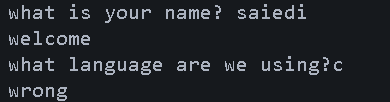
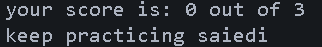
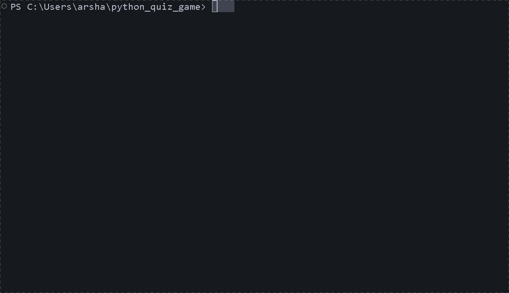

# Python Quiz Game


A simple quiz game built with Python

## Table of contents

- [Features](#features)
- [Project Structure](#project-structure)
- [Requirements](#requirements)
- [Installation](#installation)
- [Environment Setup](#environment-setup)
- [Usage](#usage)
- [Example Output](#example-output)
- [Screenshot](#screenshot)
- [Roadmap](#roadmap)
- [Contributing](#contributing)
- [License](#license)
- [Author](#author)

## Features
- Quiz System
  - Asks the player multiple questions
  - Checks the answers automatically
  - Calculates the final score
- Result Storage
  - Saves quiz results in `result.txt`
- Admin Mode
  - Asks for the admin password
  - Checks if the password is correct
  - Keeps the private information outside the main python file
  - Loads the password from `.env`

## Project Structure
```text
python_quiz_game/
│   .env.example
│   .gitignore
│   main.py
│   question.py
│   README.md
│   requirements.txt
│
├───gifs
│       quiz_demo.gif
│
├───pictures
│       quiz1.png
│       quiz2.png
│       quiz3.png
```

### File Description
| file | description|
| --- | ---|
| `main.py` | main file used to run quiz game |
| `question.py` | stores questions and answers|
| `requirements.txt` | lists the python packages needed for the project|
| `.env.example` | shows the environment variables needed by the project|
| `.gitignore` | tells git which files and folders should not be tracked|
| `README.md` | contains the project documentation|
| `pictures/` | stores project screenshots|
| `pictures/quiz1.png`| screenshot of the game start|
| `pictures/quiz2.png`| screenshot of the quiz section|
| `pictures/quiz3.png`| screenshot of the final results|
| `gifs/`| stores demo GIF files|
| `gifs/quiz_demo.gif`| shows the project demo|

## Requirements
Before running the project make sure you have
- `python 3`
- `python-dotenv`

## Installation
1. open a terminal in the project folder
2. check if python is installed
```bash
python --version
```
3. install the python packages
```bash
pip install -r requirements.txt
```
## Environment Setup
1. create a `.env` file from `.env.example`:
```bash
cp .env.example .env
```
2. open the new `.env` file
3. replace the example value with your own password
```text
QUIZ_ADMIN_PASSWORD=your_password_here
```
4. save the file
> Do not commit your `.env` file because it may contain private information

## Usage
1. open a terminal in project folder
2. run the quiz game
```bash
python main.py
```
3. choose `yes` or `no` for admin mode
4. if you choose `yes`, enter the password from your `.env` file
5. enter your name
6. answer the questions
7. see your final score and message
8. your results are saved in `result.txt`

## Example Output
```text
do you want to open admin mode? yes/no: no

what is your name? reza 
welcome

what language are we using?c
wrong

what command starts a git?git init
correct

what command shows git status?a
wrong

your score is: 1 out of 3
keep practicing reza
```
## Screenshot

### start game

### quiz

### final score


## Demo


## Roadmap
- [x] add multiple quiz question
- [x] calculate the final score
- [x] save results to a file
- [x] add admin mode
- [ ] add more quiz questions
- [ ] add difficulty levels
- [ ] add timer

## Contributing

## License

## Author
created by [Arsha Saiedi](https://github.com/arshasaiedi)